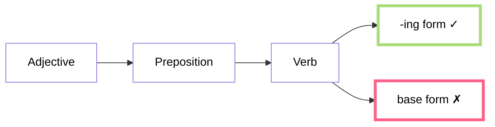
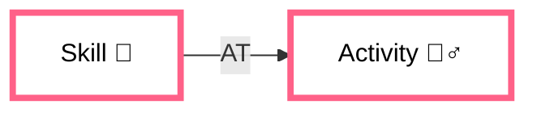
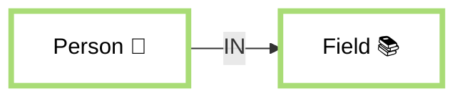
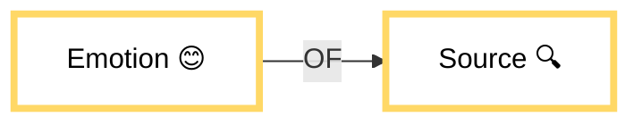
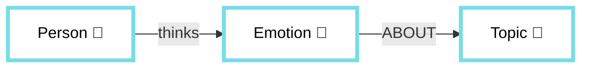
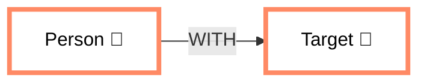
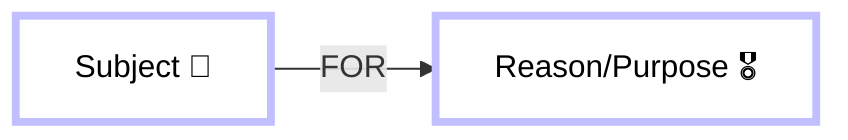
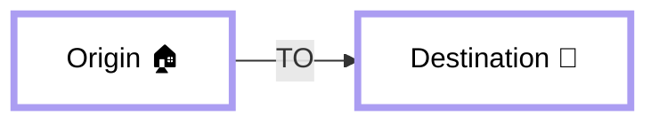
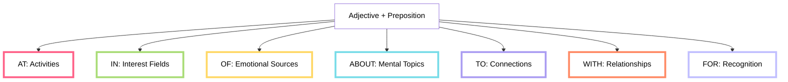

# 🧠 Adjective + Preposition

> [!tip] 🔑 Learning Strategy
> This system uses **chunking** (conceptual grouping), **mental imagery**, **mnemonics**, and **spaced repetition** to facilitate permanent memorization of these combinations.

## 🚀 How to Use This Guide

1. **Learn by groups** (don't memorize everything at once)
2. **Visualize** the examples mentally
3. **Practice** with the exercises at the end of each section
4. **Review** with the built-in flashcard system

## ⚡ The -ING Rule (Fundamental Rule)

After adjective+preposition combinations, verbs always take the -ING form:

**Examples:**

- _She's **good at swimming**_ ✓
- _She's **good at swim**_ ✗

## 📊 Level 1: Essential Combinations (80% of usage)

### Group "AT" 🎯

_Visualize throwing darts **AT** a target_

**Mnemonic: "AT targets Activities and Tasks"**

| Combination      | Visualization | Example Context                          | Common Error        |
| ---------------- | ------------- | ---------------------------------------- | ------------------- |
| good **at**      | 👍🎯          | I'm **good at dancing**                  | ~~good in/on~~      |
| bad **at**       | 👎🎯          | I'm **bad at playing** soccer            | ~~bad in/with~~     |
| surprised **at** | 😮🎯          | I'm **surprised at how** fast they learn | ~~surprised about~~ |
| angry **at**     | 😠🎯          | She's **angry at me** for forgetting     | ~~angry to~~        |
| terrible **at**  | 🫣🎯          | He's **terrible at math**                | ~~terrible in~~     |

> [!question] Practice Point
> Complete: "She's really good \_\_\_ painting."
>
> 

> 
Check your answer

> <b>at</b>
>
> Remember: We use "good at" for skills and activities (AT targets Activities and Tasks).
>
> 

### Group "IN" 📥

_Visualize interest **IN** a container_

**Mnemonic: "IN for Interest and INvolvement"**

| Combination         | Visualization | Example Context                                        | Common Error                          |
| ------------------- | ------------- | ------------------------------------------------------ | ------------------------------------- |
| interested **in**   | 👀📦          | I'm **interested in learning** languages               | ~~interested on/about~~               |
| skilled **in**      | 🛠️📦          | He's **skilled in programming**                        | ~~skilled at~~ (both correct)         |
| disappointed **in** | 😔📦          | The teacher was **disappointed in** the class behavior | ~~disappointed with~~                 |
| involved **in**     | 🤝📦          | She's **involved in** volunteer work                   | ~~involved with~~ (different meaning) |

> [!question] Practice Point
> Complete: "They're really \_\_\_ \_\_\_ biology."
>
> 

> 
Check your answer

> <b>interested in</b>
>
> Remember: Interest goes IN a container. We're interested IN topics and subjects.
>
> 

### Group "OF" 📤

_Visualize emotions that **COME FROM** something_

**Mnemonic: "OF shows Origin and Feelings"**

| Combination    | Visualization | Example Context                          | Common Error          |
| -------------- | ------------- | ---------------------------------------- | --------------------- |
| afraid **of**  | 😨🕷️          | I'm **afraid of spiders**                | ~~afraid from/about~~ |
| proud **of**   | 🦚🏆          | Parents are **proud of their** children  | ~~proud with/for~~    |
| jealous **of** | 💚👫          | She's **jealous of her** sister          | ~~jealous to/with~~   |
| fond **of**    | 🥰🐶          | The kids are very **fond of** the puppy  | ~~fond with/about~~   |
| full **of**    | 🫙✨          | The mall is always **full of** teenagers | ~~full with~~         |

> [!question] Practice Point
> Complete: "He's \_\_\_ \_\_\_ heights."
>
> 

> 
Check your answer

> <b>afraid of</b>
>
> Remember: Emotions that COME FROM something use "of". The fear originates from heights.
>
> 

## 📈 Level 2: Frequent Combinations

### Group "ABOUT" 💭

_Visualize thoughts **SURROUNDING** topics_

**Mnemonic: "ABOUT for Awareness, Beliefs, Opinions, Understanding, and Thoughts"**

| Combination       | Visualization | Example Context                | Common Error                       |
| ----------------- | ------------- | ------------------------------ | ---------------------------------- |
| worried **about** | 😟💭          | We're **worried about Maria**  | ~~worried of/for~~                 |
| excited **about** | 🤩💭          | I'm **excited about the** trip | ~~excited of/with~~                |
| upset **about**   | 😠💭          | She's **upset about the** news | ~~upset with~~ (different meaning) |

> [!question] Practice Point
> Complete: "They're \_\_\_ \_\_\_ the exam results."
>
> 

> 
Check your answer

> <b>worried about</b>
>
> Remember: Thoughts SURROUNDING topics use "about". The worry surrounds the topic of exam results.
>
> 

### Group "WITH" 🤝

_Visualize connections **TOGETHER WITH** someone/something_

**Mnemonic: "WITH creates Connections and Companionship"**

| Combination        | Visualization | Example Context                           | Common Error     |
| ------------------ | ------------- | ----------------------------------------- | ---------------- |
| angry **with**     | 😡🤝          | I'm **angry with** my brother             | ~~angry to~~     |
| friendly **with**  | 😊🤝          | She's **friendly with** her neighbors     | ~~friendly to~~  |
| satisfied **with** | 😌🤝          | We weren't **satisfied with** the service | ~~satisfied of~~ |
| busy **with**      | 🏃‍♀️🤝          | He's **busy with** a new project          | ~~busy in~~      |
| fed up **with**    | 😤🤝          | I'm **fed up with** your excuses          | ~~fed up of~~    |

> [!question] Practice Point
> Complete: "She's \_\_\_ \_\_\_ her roommate for not doing the dishes."
>
> 

> 
Check your answer

> <b>angry with</b>
>
> Remember: Emotions directed at people often use "with" to show the connection between the person and their emotion.
>
> 

### Group "FOR" 🏆

_Visualize recognition **FOR** a purpose or reason_

**Mnemonic: "FOR shows Purpose, Reason, and Recognition"**

| Combination         | Visualization | Example Context                      | Common Error       |
| ------------------- | ------------- | ------------------------------------ | ------------------ |
| famous **for**      | 🌟🏆          | Paris is **famous for** its food     | ~~famous of~~      |
| known **for**       | 📊🏆          | She's **known for** her research     | ~~known to~~       |
| good **for**        | 👍🏆          | Exercise is **good for** health      | ~~good to~~        |
| bad **for**         | 👎🏆          | Smoking is **bad for** your lungs    | ~~bad to~~         |
| responsible **for** | 👮🏆          | Who's **responsible for** this mess? | ~~responsible of~~ |

> [!question] Practice Point
> Complete: "This city is \_\_\_ \_\_\_ its beautiful architecture."
>
> 

> 
Check your answer

> <b>famous for</b>
>
> Remember: Recognition comes FOR a reason. The city is recognized FOR its architecture.
>
> 

### Group "TO" 🔗

_Visualize connections **TOWARD** something_

**Mnemonic: "TO creates Ties and Targets"**

| Combination     | Visualization | Example Context                          | Common Error      |
| --------------- | ------------- | ---------------------------------------- | ----------------- |
| married **to**  | 💍🔗          | She's **married to** a doctor            | ~~married with~~  |
| similar **to**  | 🔄🔗          | This painting is **similar to** that one | ~~similar with~~  |
| addicted **to** | 🧠🔗          | He's **addicted to** video games         | ~~addicted with~~ |
| rude **to**     | 😒🔗          | Don't be **rude to** your teachers       | ~~rude with~~     |
| kind **to**     | 😇🔗          | She's always **kind to** animals         | ~~kind with~~     |

> [!question] Practice Point
> Complete: "This book is \_\_\_ \_\_\_ the one we read last month."
>
> 

> 
Check your answer

> <b>similar to</b>
>
> Remember: Connections pointing TOWARD something use "to". The similarity points toward the other book.
>
> 

### Visual Mind Map: Preposition Connections

## 🔍 Preposition Nuances: Similar But Different

Some prepositions can be used with the same adjective with subtle differences in meaning:

### skilled in vs. skilled at

- **skilled in** → refers to fields of knowledge or disciplines
  - _She's **skilled in** physics and chemistry_ (broad field)
- **skilled at** → refers to specific activities or tasks
  - _She's **skilled at** soccer_ (specific activity)

### angry at vs. angry with

- **angry at** → focuses on the situation or event that caused anger
  - _I'm **angry at** the mistake that was made_ (directed at the action)
- **angry with** → focuses on the person you're angry with
  - _I'm **angry with** my brother_ (directed at the person)

### worried about vs. worried for

- **worried about** → general concerns about situations/topics
  - _I'm **worried about** climate change_ (concern about the situation)
- **worried for** → concerns directed at a person's welfare
  - _I'm **worried for** his safety_ (concern for someone)

## 💡 Mnemonic Memory System

### The PROPER+ Technique

Use this acronym to remember the most common prepositions:

- **P**roud **OF** (emotions from a source)
- **R**eady **FOR** (preparation toward a purpose)
- **O**bsessed **WITH** (connection to something)
- **P**roficient **AT** (skill in activities)
- **E**xcited **ABOUT** (feelings surrounding topics)
- **R**elated **TO** (connections toward something)
- **F**ull **OF** (contents within something)
- **S**urprised **AT** (reactions to specific things)
- **D**isappointed **IN** (feelings about performance)

### AT Group Story

> 🎯 Imagine you're practicing archery. You are **good at** hitting the target, but **bad at** maintaining your concentration. You're **surprised at** how difficult it can be. Your coach gets **angry at** your lack of focus but says: "To be **excellent at** this sport, you must practice daily."

### IN Group Story

> 📦 Imagine a knowledge box. Inside are books, and you're **interested in** learning their content. The more time you spend exploring the box, the more **skilled in** that subject you become. Your teacher is **disappointed in** students who don't try, but always encourages those **involved in** active learning.

### OF Group Story

> 🌊 Imagine a fountain of emotions. From this fountain flows fear, so you're **afraid of** what might emerge. Pride also springs forth, so you're **proud of** your achievements. You notice others are **jealous of** your success, but your friends are **fond of** your humble attitude. Your cup is **full of** possibilities.

## 🔄 Spaced Repetition System

Built-in static flashcard system to replace Quizlet:

  <!-- AT Group -->
  

    

      
good

      

        
at

        
/ɡʊd æt/

        
She's very <b>good at</b> solving problems.

      

    

  

  
  

    

      
bad

      

        
at

        
/bæd æt/

        
I'm <b>bad at</b> remembering names.

      

    

  

  
  <!-- IN Group -->
  

    

      
interested

      

        
in

        
/ˈɪntrəstɪd ɪn/

        
They're <b>interested in</b> modern art.

      

    

  

  
  

    

      
skilled

      

        
in

        
/skɪld ɪn/

        
He's <b>skilled in</b> various languages.

      

    

  

  
  <!-- OF Group -->
  

    

      
afraid

      

        
of

        
/əˈfreɪd ʌv/

        
Many people are <b>afraid of</b> public speaking.

      

    

  

  
  

    

      
proud

      

        
of

        
/praʊd ʌv/

        
Parents are <b>proud of</b> their children's achievements.

      

    

  

  
  <!-- ABOUT Group -->
  

    

      
worried

      

        
about

        
/ˈwʌrid əˈbaʊt/

        
We're <b>worried about</b> climate change.

      

    

  

  
  

    

      
excited

      

        
about

        
/ɪkˈsaɪtɪd əˈbaʊt/

        
The children are <b>excited about</b> the school trip.

      

    

  

  
  <!-- TO Group -->
  

    

      
married

      

        
to

        
/ˈmærid tuː/

        
She's been <b>married to</b> him for twenty years.

      

    

  

  
  

    

      
similar

      

        
to

        
/ˈsɪmɪlər tuː/

        
This music is <b>similar to</b> what we heard yesterday.

      

    

  

  
  <!-- WITH Group -->
  

    

      
angry

      

        
with

        
/ˈæŋɡri wɪð/

        
She's <b>angry with</b> her brother for breaking her toy.

      

    

  

  
  

    

      
satisfied

      

        
with

        
/ˈsætɪsfaɪd wɪð/

        
I'm not <b>satisfied with</b> the quality of service.

      

    

  

  
  <!-- FOR Group -->
  

    

      
famous

      

        
for

        
/ˈfeɪməs fɔːr/

        
Paris is <b>famous for</b> its beautiful architecture.

      

    

  

  
  

    

      
known

      

        
for

        
/noʊn fɔːr/

        
She's <b>known for</b> her excellent research.

      

    

  

  
  <!-- Additional combinations -->
  

    

      
surprised

      

        
at

        
/sərˈpraɪzd æt/

        
I'm <b>surprised at</b> how well the event was organized.

      

    

  

  
  

    

      
fond

      

        
of

        
/fɒnd ʌv/

        
My grandmother is very <b>fond of</b> her garden.

      

    

  

## 📋 Complete Reference: Adjective + Preposition Combinations

| Preposition | Common Adjectives                                  | Example                                |
| ----------- | -------------------------------------------------- | -------------------------------------- |
| **AT**      | good, bad, surprised, angry, terrible, excellent   | She's **good at** tennis               |
| **IN**      | interested, skilled, disappointed, involved        | They're **involved in** community work |
| **OF**      | proud, afraid, fond, jealous, full, aware          | I'm **proud of** your progress         |
| **ABOUT**   | worried, excited, upset, curious, serious          | We're **excited about** the trip       |
| **WITH**    | satisfied, busy, fed up, obsessed, angry, friendly | I'm **busy with** a project            |
| **FOR**     | known, famous, good, bad, sorry, responsible       | The city is **famous for** its food    |
| **TO**      | married, similar, related, new, rude, kind         | She's **married to** a doctor          |

## 📝 Practice Exercises

### Complete the phrases

1. I'm interested **\_** learning Chinese.
2. She's afraid **\_** heights.
3. He's known **\_** being punctual.
4. They're worried **\_** their son.
5. I'm bad **\_** remembering names.
6. She's married **\_** a doctor.
7. We're satisfied **\_** the results.
8. Paris is famous **\_** its architecture.

Check your answers

1. I'm interested **in** learning Chinese.
2. She's afraid **of** heights.
3. He's known **for** being punctual.
4. They're worried **about** their son.
5. I'm bad **at** remembering names.
6. She's married **to** a doctor.
7. We're satisfied **with** the results.
8. Paris is famous **for** its architecture.

### Correct the errors

1. She's good ~~in~~ \_\_\_ dancing.
2. I'm afraid ~~from~~ \_\_\_ snakes.
3. They're excited ~~for~~ \_\_\_ the concert.
4. He's married ~~with~~ \_\_\_ a doctor.
5. We're worried ~~of~~ \_\_\_ climate change.

Check your answers

1. She's good ~~in~~ **at** dancing.
2. I'm afraid ~~from~~ **of** snakes.
3. They're excited ~~for~~ **about** the concert.
4. He's married ~~with~~ **to** a doctor.
5. We're worried ~~of~~ **about** climate change.

### Group Sorting Exercise

Sort these adjectives by their correct preposition:

**Adjectives**: good, proud, interested, worried, married, angry, famous, full, disappointed, skilled, afraid, excited

**AT**: ******\_\_\_\_******  
**IN**: ******\_\_\_\_******  
**OF**: ******\_\_\_\_******  
**ABOUT**: ******\_\_\_\_******  
**TO**: ******\_\_\_\_******  
**WITH**: ******\_\_\_\_******  
**FOR**: ******\_\_\_\_******

Check your answers

**AT**: good, skilled  
**IN**: interested, disappointed  
**OF**: proud, afraid, full  
**ABOUT**: worried, excited  
**TO**: married  
**WITH**: angry  
**FOR**: famous

## 📚 The Grand Story: All Adjectives in Action

> Maria was **interested in** learning English, although she was **bad at** memorizing vocabulary. She was often **worried about** her exams and **afraid of** making mistakes in public.
>
> Her teacher, **famous for** his innovative teaching techniques, was **married to** a linguist. He was **good at** explaining grammar rules and always **friendly with** students who made an effort.
>
> One day, Maria met Elena, an advanced student **skilled in** conversation. Maria was **jealous of** Elena's fluency, but also **excited about** practicing with her.
>
> "Don't be **angry with** your mistakes," Elena advised her. "We were all **afraid of** speaking at first."
>
> As Maria practiced, she became more **confident of** her abilities. By the end of the semester, her teacher was **proud of** her progress, and she was no longer **upset about** her initial difficulties.
>
> The teacher's technique was **similar to** a natural immersion process, and Maria finally understood that language was **different from** what she had imagined: it wasn't a set of rules but a tool for connecting with people.

> [!tip] Memorization Strategy
> Read this story several times paying attention to the adjective+preposition combinations. Try to recreate it mentally like a movie, visualizing the scenes and associating each combination with its context.

## 🔗 Additional Resources

- [[Common Prepositions]]
- [[Verb + Preposition]]
- [[English Grammar Overview]]

---

#grammar #english #prepositions #spaced-repetition
