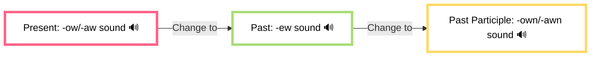

# 🔄 Irregular Verbs (Part 1)

> [!tip] 🔑 Learning Strategy
> This guide organizes irregular verbs by similar sound and spelling patterns to make them easier to memorize and recognize in context.

## 🚀 How to Use This Guide

1. **Study by pattern groups** (not alphabetically)
2. **Practice aloud** to reinforce sound patterns
3. **Create sentences** using all three forms
4. **Review regularly** using the built-in system

## 📊 Pattern Group 1: "OW" Sound Transformation

These verbs follow a pattern where the present form often has an "o" sound that changes to "e" in the past and returns to "o" in the past participle.

### The "ow → ew → own" Pattern

| Base Form | Past Simple | Past Participle | Example Sentence |
|-----------|-------------|-----------------|------------------|
| know      | knew        | known           | I **know** the answer now. I **knew** it yesterday. I've always **known** this fact. |
| blow      | blew        | blown           | The wind **blows** hard today. It **blew** my hat off. The candles have been **blown** out. |
| grow      | grew        | grown           | Plants **grow** quickly here. She **grew** taller last year. These vegetables are home-**grown**. |
| throw     | threw       | thrown          | I often **throw** the ball to my dog. She **threw** a surprise party. He has **thrown** away the receipt. |
| fly       | flew        | flown           | Birds **fly** south in winter. The plane **flew** through the storm. We've **flown** to Paris twice. |
| draw      | drew        | drawn           | I **draw** every day. She **drew** a beautiful picture. The curtains have been **drawn** closed. |

> [!question] Practice Point
> Complete: "The wind **\_\_\_** (blow) very hard yesterday, but it has not **\_\_\_** (blow) today."
>
> 

> 
Check your answer

> The wind <b>blew</b> very hard yesterday, but it has not <b>blown</b> today.
> 

## 💡 Mnemonic Story: The Growing Garden

> A gardener **knew** he wanted to create a beautiful garden. He **grew** many types of plants. The wind **blew** strongly, but none of his plants were **blown** away. Birds **flew** around the garden and had **flown** there from many places. He **drew** plans for expanding the garden, and the plans were **drawn** with great detail. Sometimes, he **threw** seeds to grow wildflowers, and the seeds had been **thrown** across the entire back section.

## 💬 Common Expressions and Collocations

- **looking forward to** - anticipating something with pleasure
  - *"I'm **looking forward to** seeing you next week."*
- **I can't think of anything** - unable to generate ideas
  - *"When asked for suggestions, **I couldn't think of anything**."*
- **I can't get the word** - unable to recall a specific word
  - *"I know what I want to say, but **I can't get the word** right now."*

## 🏙️ vs 🌄 Environmental Vocabulary

| Urban Setting | Countryside Setting |
|---------------|---------------------|
| building      | field               |
| sidewalk      | path                |
| traffic light | mill                |
| apartment     | cottage             |
| subway        | creek/stream        |
| parking lot   | meadow              |
| skyscraper    | lake                |

## 🍴 Household Items Vocabulary

| Kitchen Items | Bedroom Items | Other Household |
|---------------|---------------|-----------------|
| spoon         | blanket       | smoke detector  |
| knife         | pillow        | light bulb      |
| fork          | hairdryer     | duct tape       |
| silverware    | bed frame     | carpet          |
| cutlery       | nightstand    | tray            |
| butter knife  | alarm clock   | stick           |

> [!note] American vs. British English
> Some pronunciation differences exist between American and British English. For instance, American English often pronounces 't' sounds more like 'r' in certain contexts (known as the alveolar flap). Example: "butter" sounds closer to "budder" in American English.

## 🔄 Practice Exercises

### Complete the sentences with the correct verb form

1. She _______ (know) the answer to the question.
2. The wind _______ (blow) all the leaves off the trees last night.
3. The baby _______ (grow) a lot in the past year.
4. The artist _______ (draw) a beautiful portrait of the family.
5. The pitcher _______ (throw) the ball at 95 mph.

Check your answers

1. She **knows/knew/has known** the answer to the question.
2. The wind **blew** all the leaves off the trees last night.
3. The baby **has grown** a lot in the past year.
4. The artist **drew/has drawn** a beautiful portrait of the family.
5. The pitcher **throws/threw/has thrown** the ball at 95 mph.

### Create complete sentences

Create a sentence using all three forms of each verb:

1. know: ________________________________________
2. fly: ________________________________________
3. throw: ________________________________________

Sample answers

1. I **know** English grammar rules now. I **knew** some of them before the class. I have **known** about irregular verbs for a week.

2. Birds **fly** south for winter. The plane **flew** over our house yesterday. I have **flown** to many countries.

3. I **throw** paper in the recycling bin. She **threw** a wonderful party last weekend. He has **thrown** away his old clothes.

## 📚 Verb Form Story: An Angry Mom

> My mom was **angry** with my brother. She **threw** his toys across the room when she **knew** he had **drawn** on the walls. He had **flown** into a rage earlier and had **grown** increasingly defiant. The wind **blew** through the open window as the curtains had been **drawn** back. As my mom **grew** calmer, she made us clean up the mess that had been **thrown** around the room. She had always **known** his tantrums would pass, and once the situation had **blown** over, everything returned to normal.

## 🔄 Spaced Repetition Flashcards

  

    

      
know

      

        
knew / known

        
/noʊ/ → /nuː/ → /noʊn/

        
I <b>know</b> him well. I <b>knew</b> him in college. I've <b>known</b> him for years.

      

    

  

  
  

    

      
blow

      

        
blew / blown

        
/bloʊ/ → /bluː/ → /bloʊn/

        
The winds <b>blow</b> hard here. It <b>blew</b> my hat off. The candle has been <b>blown</b> out.

      

    

  

  
  

    

      
grow

      

        
grew / grown

        
/ɡroʊ/ → /ɡruː/ → /ɡroʊn/

        
Plants <b>grow</b> fast here. She <b>grew</b> taller. The vegetables are home-<b>grown</b>.

      

    

  

  
  

    

      
throw

      

        
threw / thrown

        
/θroʊ/ → /θruː/ → /θroʊn/

        
I <b>throw</b> the ball. She <b>threw</b> a party. He has <b>thrown</b> it away.

      

    

  

  
  

    

      
fly

      

        
flew / flown

        
/flaɪ/ → /fluː/ → /floʊn/

        
Birds <b>fly</b> south. We <b>flew</b> to Paris. They have <b>flown</b> home.

      

    

  

  
  

    

      
draw

      

        
drew / drawn

        
/drɔː/ → /druː/ → /drɔːn/

        
I <b>draw</b> daily. She <b>drew</b> a picture. The curtains are <b>drawn</b>.

      

    

  

## 🔗 Related Topics

- [[regular-verbs|Regular Verb Conjugation]]
- [[verb-tenses|English Verb Tenses]]
- [[american-british-differences|American vs. British English]]

---

#grammar #english #verbs #irregular-verbs