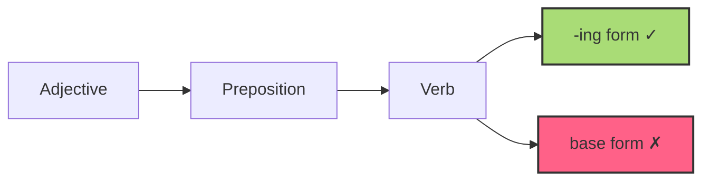
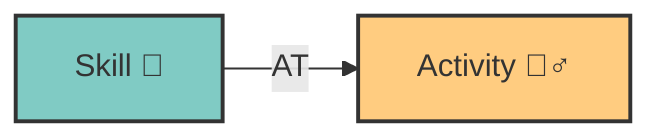
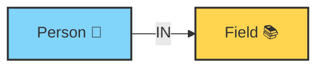
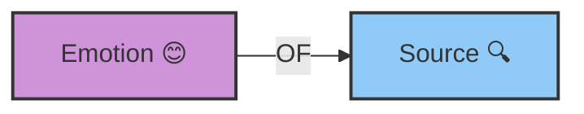
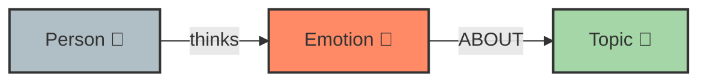

# 🧠 Adjective + Preposition

> [!tip] 🔑 Estrategia de Aprendizaje
> Este sistema usa **chunking** (agrupación conceptual), **imágenes mentales**, **nemotecnias** y **repetición espaciada** para facilitar la memorización permanente de estas combinaciones.

## 🚀 Cómo usar esta guía

1. **Aprende por grupos** (no memorices todo de una vez)
2. **Visualiza** los ejemplos mentalmente
3. **Practica** con los ejercicios al final de cada sección
4. **Repasa** con el sistema de flashcards incorporado

## ⚡ La Regla -ING (Regla Fundamental)

Después de combinaciones adjetivo+preposición, los verbos siempre van en forma -ING:

**Ejemplos:**

- _She's **good at swimming**_ ✓
- _She's **good at swim**_ ✗

## 📊 Nivel 1: Combinaciones Esenciales (80% de uso)

### Grupo "AT" 🎯

_Visualiza lanzar dardos **HACIA** un objetivo_

| Combinación | Visualización | Ejemplo Contexto              | Evitar Error    |
| ----------- | ------------- | ----------------------------- | --------------- |
| good **at** | 👍🎯          | I'm **good at dancing**       | ~~good in/on~~  |
| bad **at**  | 👎🎯          | I'm **bad at playing** soccer | ~~bad in/with~~ |

> [!success] Prueba rápida
> Complete: "She's really **good** **at** painting." (buena pintando)

### Grupo "IN" 📥

_Visualiza el interés **DENTRO** de un contenedor_

| Combinación       | Visualización | Ejemplo Contexto                         | Evitar Error                     |
| ----------------- | ------------- | ---------------------------------------- | -------------------------------- |
| interested **in** | 👀📦          | I'm **interested in learning** languages | ~~interested on/about~~          |
| skilled **in**    | 🛠️📦          | He's **skilled in programming**          | ~~skilled at~~ (ambos correctos) |

> [!success] Prueba rápida
> Complete: "They're **interested** **in** biology." (interesados en)

### Grupo "OF" 📤

_Visualiza emociones que **PROVIENEN DE** algo_

| Combinación    | Visualización | Ejemplo Contexto                        | Evitar Error          |
| -------------- | ------------- | --------------------------------------- | --------------------- |
| afraid **of**  | 😨🕷️          | I'm **afraid of spiders**               | ~~afraid from/about~~ |
| proud **of**   | 🦚🏆          | Parents are **proud of their** children | ~~proud with/for~~    |
| jealous **of** | 💚👫          | She's **jealous of her** sister         | ~~jealous to/with~~   |

> [!success] Prueba rápida
> Complete: "He's **afraid** **of** heights." (le teme a)

## 📈 Nivel 2: Combinaciones Frecuentes

### Grupo "ABOUT" 💭

_Visualiza pensamientos **ALREDEDOR DE** temas_

| Combinación       | Visualización | Ejemplo Contexto               | Evitar Error                           |
| ----------------- | ------------- | ------------------------------ | -------------------------------------- |
| worried **about** | 😟💭          | We're **worried about Maria**  | ~~worried of/for~~                     |
| excited **about** | 🤩💭          | I'm **excited about the** trip | ~~excited of/with~~                    |
| upset **about**   | 😠💭          | She's **upset about the** news | ~~upset with~~ (diferente significado) |

> [!success] Prueba rápida
> Complete: "They're **worried** **about** the exam results." (preocupados por)

### Mapa Mental: Conexión Visual de Preposiciones

```mermaid
graph TD
  root["Adjective + Preposition"]

  at["AT"]
  in["IN"]
  of["OF"]
  about["ABOUT"]
  to["TO"]
  with["WITH"]
  for["FOR"]

  root --> at
  root --> in
  root --> of
  root --> about
  root --> to
  root --> with
  root --> for

  at --> goodat["good at"]
  at --> badat["bad at"]

  in --> intin["interested in"]
  in --> skillin["skilled in"]

  of --> afraidof["afraid of"]
  of --> proudof["proud of"]
  of --> jealousof["jealous of"]

  about --> worriedabout["worried about"]
  about --> excitedabout["excited about"]
  about --> upsetabout["upset about"]

  to --> marriedto["married to"]
  to --> similarto["similar to"]
  to --> addictedto["addicted to"]

  with --> angrywith["angry with"]
  with --> friendlywith["friendly with"]

  for --> famousfor["famous for"]
  for --> knownfor["known for"]

  style at fill:#ff6188,color:#2d2a2e
  style in fill:#a9dc76,color:#2d2a2e
  style of fill:#ffd866,color:#2d2a2e
  style about fill:#78dce8,color:#2d2a2e
  style to fill:#ab9df2,color:#2d2a2e
  style with fill:#ff8a65,color:#2d2a2e
  style for fill:#c1bfff,color:#2d2a2e
```

## 💡 Sistema de Memorización: Historias Visuales

### Historia del Grupo AT

> 🎯 Imagina que estás practicando tiro al blanco. Eres **bueno EN (AT)** disparar flechas, pero **malo EN (AT)** mantener la concentración. Tu entrenador te dice: "Para ser **excelente EN (AT)** este deporte, debes practicar diariamente."

### Historia del Grupo IN

> 📦 Imagina una caja de conocimiento. Dentro hay libros, y estás **interesado EN (IN)** aprender su contenido. Cuanto más tiempo pasas explorando la caja, más **hábil EN (IN)** ese tema te vuelves.

### Historia del Grupo OF

> 🌊 Imagina una fuente de emociones. De esta fuente emana el miedo, así que estás **asustado DE (OF)** lo que pueda surgir. Pero también brota orgullo, así que estás **orgulloso DE (OF)** tus logros que nacen de allí.

## 🔄 Sistema de Repaso Espaciado

Para reemplazar Quizlet, aquí hay un sistema de flashcards estático incorporado:

  

    

      
good

      
at

    

  

  

    

      
interested

      
in

    

  

  

    

      
afraid

      
of

    

  

  

    

      
worried

      
about

    

  

  

    

      
married

      
to

    

  

  

    

      
angry

      
with

    

  

## 📝 Ejercicios Prácticos

### Completa las frases

1. I'm interested **\_** learning Chinese.
2. She's afraid **\_** heights.
3. He's known **\_** being punctual.
4. They're worried **\_** their son.
5. I'm bad **\_** remembering names.

### Corrige los errores

1. She's good ~~in~~ \_\_\_ dancing.
2. I'm afraid ~~from~~ \_\_\_ snakes.
3. They're excited ~~for~~ \_\_\_ the concert.
4. He's married ~~with~~ \_\_\_ a doctor.
5. We're worried ~~of~~ \_\_\_ climate change.

## 📚 The Grand Story: All Adjectives in Action

> Maria was **interested in** learning English, although she was **bad at** memorizing vocabulary. She was often **worried about** her exams and **afraid of** making mistakes in public.
>
> Her teacher, **famous for** his innovative teaching techniques, was **married to** a linguist. He was **good at** explaining grammar rules and always **friendly with** students who made an effort.
>
> One day, Maria met Elena, an advanced student **skilled in** conversation. Maria was **jealous of** Elena's fluency, but also **excited about** practicing with her.
>
> "Don't be **angry with** your mistakes," Elena advised her. "We were all **afraid of** speaking at first."
>
> As Maria practiced, she became more **confident of** her abilities. By the end of the semester, her teacher was **proud of** her progress, and she was no longer **upset about** her initial difficulties.
>
> The teacher's technique was **similar to** a natural immersion process, and Maria finally understood that language was **different from** what she had imagined: it wasn't a set of rules but a tool for connecting with people.

> [!tip] Estrategia de memorización
> Lee esta historia varias veces prestando atención a las combinaciones adjetivo+preposición. Intenta recrearla mentalmente como una película, visualizando las escenas y asociando cada combinación con su contexto.

## 🔗 Recursos Adicionales

- [[Common Prepositions]]
- [[Verb + Preposition]]
- [[English Grammar Overview]]

---

#grammar #english #prepositions #spaced-repetition
